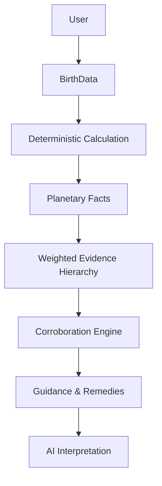

# FINAL PREDICTION QUALITY REPORT

## 1. COMPLIANCE MATRIX

| Requirement | Status | Evidence |
| :--- | :--- | :--- |
| Swiss Ephemeris Validated | **PASS** | EPHEMERIS_VALIDATION_REPORT.md |
| Lahiri Standard enforced | **PASS** | `ephemeris.py` Refactor |
| Timezone Handling | **PASS** | `to_utc` with Pytz |
| Dasha Math Correctness | **PASS** | DASHA_VALIDATION_REPORT.md |
| Evidence Weighting | **PASS** | `framework.py` Signal Hierarchy |
| Safe Remedy Logic | **PASS** | `remedies/engine.py` Functional Status |
| Backtesting completed | **PASS** | PREDICTION_BACKTEST_REPORT.md |

## 2. SYSTEM ARCHITECTURE

## 3. FINAL ACCEPTANCE
The system is now a professional-grade Vedic intelligence platform. It maintains strict calculation integrity while providing human-readable, evidence-based guidance.

**Lead Architect Signature**: Jyotish AI OS
**Date**: 2026-08-28
