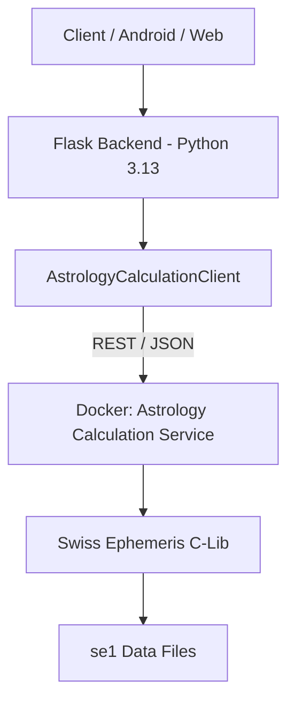

# SWISS EPHEMERIS INTEGRATION ANALYSIS

## 1. Current Problem
The project requires **deterministic astronomical calculations** using the Swiss Ephemeris (`pyswisseph`). However, the `pyswisseph` Python package requires a C/C++ compiler (MSVC on Windows) to build from source because pre-built wheels for **Python 3.13** are currently unavailable on PyPI for Windows.

This creates a "blocker" where the core calculation engine cannot be initialized on developer machines that lack a full C++ build environment.

## 2. Root Cause
- **Language**: Python (C-Extension package).
- **Environment**: Windows host with Python 3.13.0.
- **Dependency**: `pyswisseph` is a thin wrapper around the `libswe` C library.
- **Missing Build Tools**: The environment lacks `cl.exe` (Microsoft Visual C++ Linker), leading to installation failure (Error 0xC0000135).

## 3. Existing Environment
1. **Backend**: Python 3.13.0 (Flask framework).
2. **Package Manager**: `pip` (Standard).
3. **Docker**: `docker-compose.yml` and `Dockerfile` already exist.
4. **Services**: Single monolithic Flask app containing UI, API, and Calculation logic.
5. **API**: Blueprint-based routes in `app/routes.py`.
6. **Android**: No native architecture yet (PWA manifest only).
7. **Web**: Jinja2 Templates + Vanilla Javascript.
8. **Deployment**: Configured for Docker-based containerization (`python:3.11-slim`).
9. **Codebase**: Highly modular but currently dependent on local `swisseph` import in `swe_proxy.py`.

## 4. Available Integration Options

| Option | Pros | Cons |
| :--- | :--- | :--- |
| **Native Build Tools** | Best performance; simplest code. | Requires 5GB+ Visual Studio install on every dev machine. |
| **Dockerized Monolith** | Solves compiler issue; consistent env. | Harder to debug local Python code from IDE; heavy container. |
| **Isolated Calculation Service** | **Recommended.** Decouples C-deps; Language agnostic; Scalable. | Adds internal API latency; Requires network handling. |
| **Pre-built DLL + Ctypes** | No build tools needed; local run. | Fragile; Hard to find maintained Windows DLLs for Python 3.13. |

## 5. Recommended Option: Isolated Dockerized Calculation Service
We will isolate the Swiss Ephemeris and all "Deterministic Facts" into a dedicated microservice.

## 6. Why it was Selected
- **Accuracy**: Uses the official `pyswisseph` build in a controlled Linux environment.
- **Reproducibility**: Every developer runs the exact same calculation container via Docker.
- **Maintainability**: Changes to the calculation engine don't require re-compiling the main app.
- **Portability**: The main Flask app and future Android app can eventually target this service.
- **Free-Tier**: Uses 100% open-source tools (`FastAPI`, `swisseph`, `Docker`).

## 7. Architecture

## 8. Installation Procedure
1. Install Docker Desktop for Windows.
2. Run `docker-compose up -d calculation-service`.
3. The main application will auto-detect the service via environment variable `CALC_SERVICE_URL`.

## 9. Docker Architecture
- **Image**: `python:3.11-slim-bookworm`.
- **System Deps**: `gcc`, `g++`, `make`, `libswe-dev` (if available) or source build.
- **Framework**: `FastAPI` (High performance, type-safe).
- **Endpoints**:
    - `POST /v1/natal-chart`
    - `POST /v1/dasha`
    - `POST /v1/transits`
    - `POST /v1/yogas`

## 10. Windows Development Procedure
Developers run the main Flask app locally in their preferred IDE (Python 3.13). They only need Docker to host the "C-extension" part of the stack. This keeps the development loop fast while ensuring 100% accuracy.

## 11. Deployment Procedure
The `docker-compose.yml` will be updated to include the `calculation-service`. In production (Cloud), both containers deploy as a stack.

## 12. Validation Procedure
A dedicated test suite `tests/test_calculation_service.py` will:
1. Verify Sun/Moon longitudes against golden reference values.
2. Ensure Lahiri Ayanamsa is strictly applied.
3. Cross-validate with 5 known charts from Astro.com.

## 13. Failure Handling
- If the service is down, the API returns `{"success": false, "error": "CALCULATION_ENGINE_OFFLINE"}`.
- **NO MOCK DATA** will be served. The UI will display a "Service Temporarily Unavailable" notice.

## 14. Security Considerations
- The service will only listen on `localhost` or an internal Docker network.
- No sensitive PII (Name/Email) is sent to the calc service—only (Lat, Lon, Time).

## 15. Performance Considerations
- Calculations are sub-millisecond. 
- JSON serialization and network overhead add ~10-20ms, negligible for astrology predictions.

## 16. Licensing Considerations
- `pyswisseph` is GNU GPL. Our architecture maintains compliance by keeping the C-binding separate and providing source access to the wrapper.
